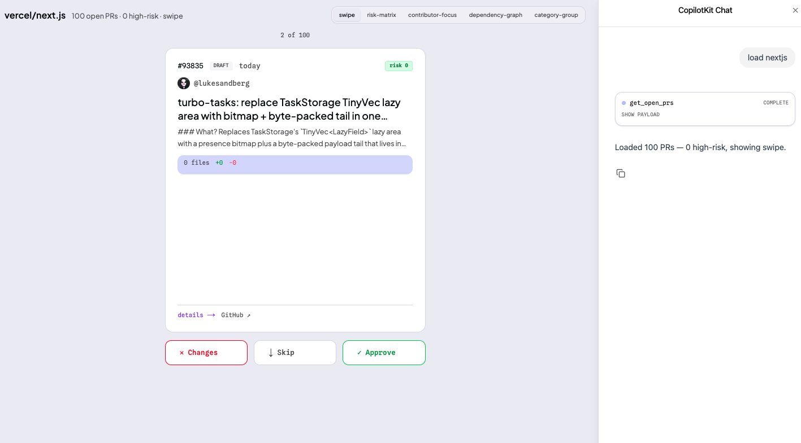
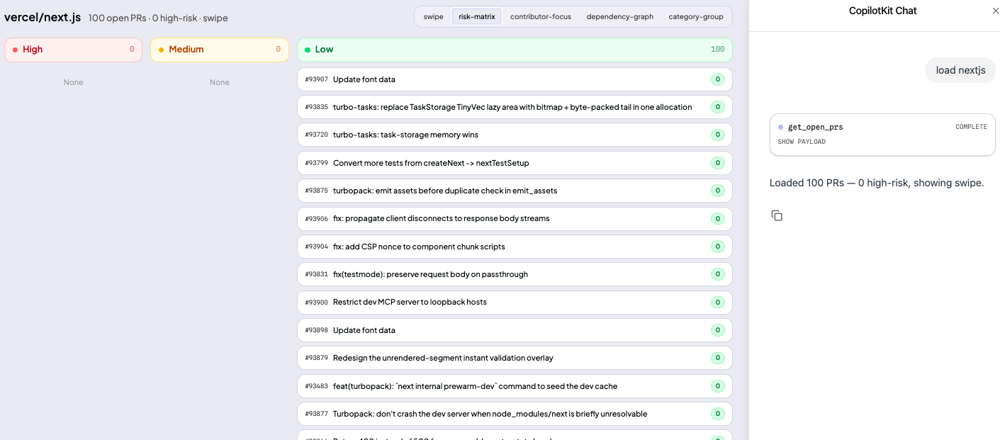
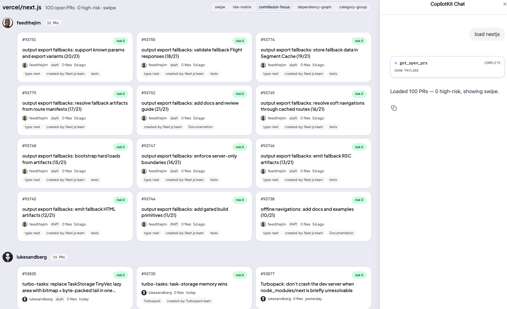
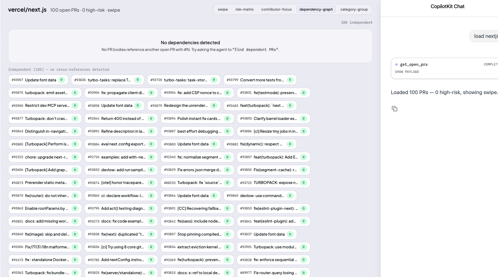
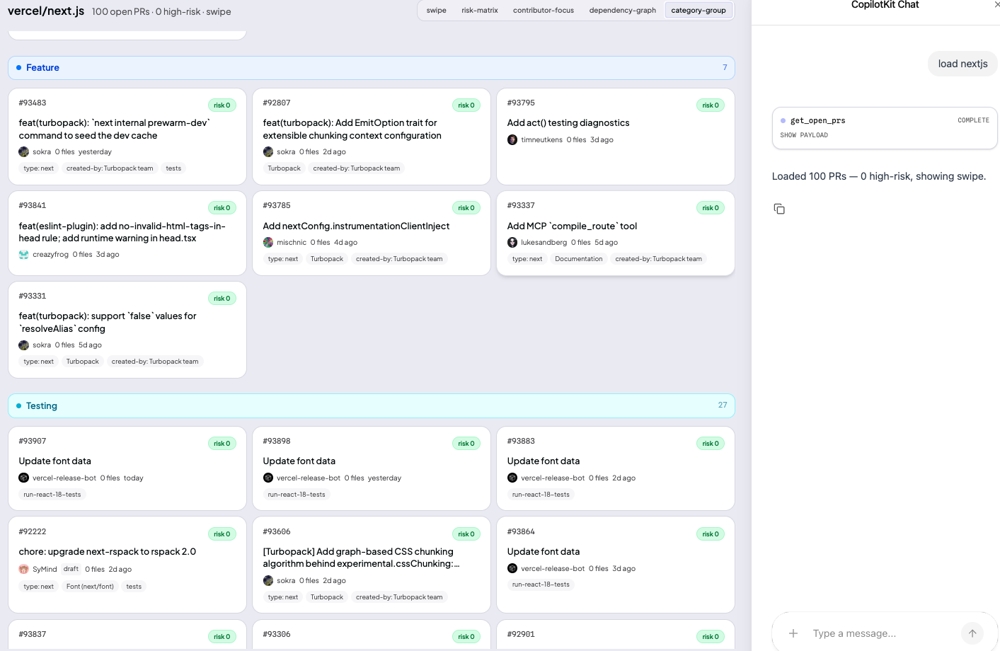

# PRs on Edge

PRs on Edge is a generative UI system for GitHub pull-request triage. Instead of forcing reviewers into one static dashboard, the agent reads a repository’s open PRs, scores risk, detects queue shape, and renders the interface that best fits the moment.

The project explores a simple question: if an AI agent understands the review queue, should it answer with text, or should it generate the review surface itself?



## What it does

- Reads open pull requests from a GitHub repository.
- Scores each PR using lightweight runtime heuristics.
- Chooses the most useful interface for the current queue.
- Lets reviewers inspect, batch, and triage PRs faster on a lightweight surface.
- Uses CopilotKit + a LangGraph agent to keep the UI agent-driven rather than hard-coded.

## Why this is different

Most AI coding assistants stop at summarization:

- "Here are your open PRs."
- "This one looks risky."
- "You should probably review these first."

PRs on Edge pushes one step further. The output is not just analysis text. The output is a review surface the agent selects at runtime.

That means the system is not trying to be a better dashboard configuration tool. It is trying to replace the assumption that one fixed dashboard is enough for every queue shape.

## Demo prompts

Use prompts like these when you show the product:

- `load nextjs`
- `switch to risk-matrix view`
- `show contributor-focus`
- `find dependent PRs`
- `group these PRs by category`
- `show the highest-risk pull requests first`

## The five interface modes

### 1. Swipe

Best when the queue is small enough for direct one-by-one review. The reviewer gets a focused card surface with explicit approve, skip, or inspect actions.


### 2. Risk Matrix

Best when the real problem is prioritization. PRs are grouped into high, medium, and low-risk columns so reviewers can attack the highest-signal changes first.



### 3. Contributor Focus

Best when one contributor or team dominates the queue. PRs are grouped by author so review effort can be coordinated around ownership rather than raw chronology.



### 4. Dependency Graph

Best when merge order matters. The interface surfaces whether PRs are independent or linked so related changes do not get merged out of sequence.



### 5. Category Group

Best when the queue is noisy. PRs are clustered by type such as feature work, testing, maintenance, or documentation so similar changes can be processed together.



## How view selection works

The agent chooses among:

- `swipe`
- `risk-matrix`
- `contributor-focus`
- `dependency-graph`
- `category-group`

The current heuristics already support automatic switching for queue shape and risk distribution, and the user can still explicitly ask the agent to change modes.

## What the agent looks at

- Open PR count
- Risk score distribution
- Contributor concentration
- Cross-references between PRs
- Category or topic patterns in the queue

Those signals drive both prioritization and interface selection.

## Stack

- Next.js
- React
- TypeScript
- CopilotKit
- LangGraph / Deep Agents
- Gemini
- GitHub API
- Docker
- Python agent runtime

## Repo structure

```text
.
├── apps/
│   ├── agent/      # LangGraph / Deep Agent backend
│   ├── bff/        # backend-for-frontend services
│   ├── frontend/   # Next.js UI
│   └── mcp/        # MCP server surface
├── deployment/     # local infra / compose files
├── dev-docs/       # setup and architecture notes
└── scripts/        # local dev helpers
```

## Run locally

### Prerequisites

Install these first:

- Node.js 20+
- Python 3.10+
- `uv`
- Docker Desktop

### 1. Create env files

```bash
cp .env.example .env
cp apps/agent/.env.example apps/agent/.env
```

### 2. Add required keys

At minimum, set:

- `GEMINI_API_KEY` in `apps/agent/.env`
- `COPILOTKIT_LICENSE_TOKEN` in `.env`

Optional but recommended:

- `GITHUB_TOKEN` in `apps/agent/.env` for better GitHub API rate limits

### 3. Install dependencies

```bash
npm install
```

### 4. Start the app

```bash
npm run dev
```

This boots local infrastructure plus the UI, BFF, and agent runtime.

### 5. Open the app

```text
http://localhost:3010
```

The frontend root redirects to:

```text
/leads
```

## Useful scripts

```bash
npm run dev         # UI + BFF + agent
npm run dev:full    # UI + BFF + agent + MCP server
npm run build       # frontend production build
npm run lint        # frontend linting
```

## Notes

- `scripts/check-env.sh` runs before `npm run dev` and fails fast if Docker or required keys are missing.
- The Python agent runs through `uv`.
- The app was built as a hackathon exploration of agentic interfaces, but the UI system is structured enough to extend into a real developer-tool workflow.

## Positioning

PRs on Edge is not just a PR dashboard. It is an experiment in letting the agent choose the interface, not just the answer.

That distinction is the point of the project.
